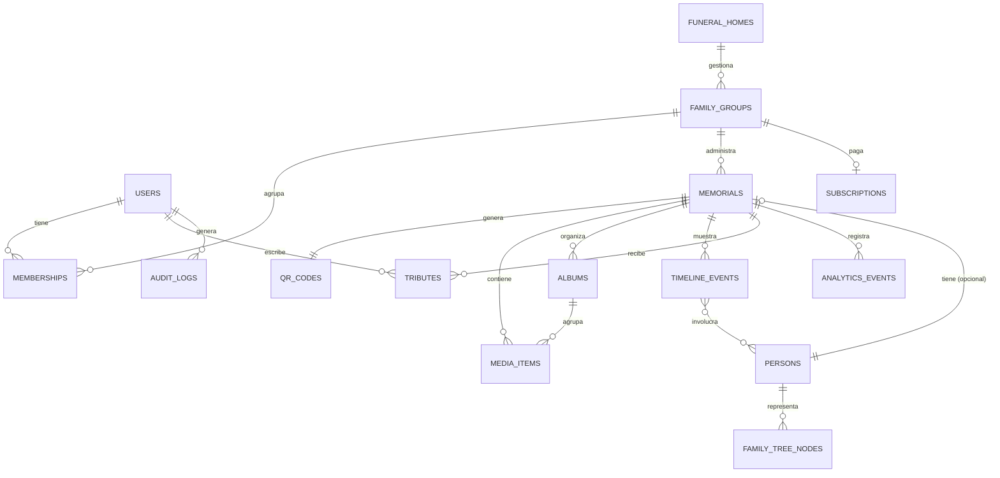

# Dorsera Memorial — Documento Fundacional de Producto y Arquitectura

## 1. Visión del producto

**Dorsera Memorial** es la capa del ecosistema Dorsera dedicada a preservar la memoria de quienes ya no están. Si Dorsera documenta la historia familiar en vida, Dorsera Memorial la conserva después de la partida, unida por el mismo árbol genealógico y el mismo UUID de persona, sin duplicar datos.

**Promesa de marca:** un código QR en una lápida se convierte en una puerta a toda una vida — fotos, voz, historia, familia.

**Principios de diseño de producto:**
- *Respeto antes que funcionalidad*: cada feature se filtra por "¿esto honra o distrae?"
- *Simplicidad radical para el usuario final* (familias en duelo, muchas veces mayores o no técnicas) vs. *profundidad para el poder-usuario* (funerarias, administradores familiares).
- *Perpetuidad*: el dato debe sobrevivir a la empresa. Backups, exportación completa, y una promesa de "legado garantizado" son parte del producto, no un extra técnico.

---

## 2. Arquitectura completa (visión técnica)

```
┌─────────────────────────────────────────────────────────────────┐
│                         CLIENTES                                  │
│  Web pública memorial (SSR)   │   App Admin (Next.js SPA/SSR)     │
│  Escáner QR → landing rápida  │   Panel funeraria / familia        │
└───────────────┬───────────────────────────┬──────────────────────┘
                │ HTTPS/CDN                 │ HTTPS
                ▼                           ▼
        ┌───────────────────────────────────────────┐
        │   Vercel Edge Network + Next.js App Router  │
        │   ISR para páginas de memorial (público)    │
        │   Route Handlers / Server Actions (privado) │
        └───────────────┬─────────────────────────────┘
                        │
        ┌───────────────▼─────────────────────────────┐
        │              Supabase (BaaS)                  │
        │  ┌─────────────┐ ┌───────────┐ ┌────────────┐ │
        │  │ PostgreSQL  │ │  Storage  │ │  Realtime  │ │
        │  │  + RLS      │ │ (media)   │ │ (libro     │ │
        │  │             │ │           │ │  recuerdos)│ │
        │  └─────────────┘ └───────────┘ └────────────┘ │
        │  ┌─────────────┐ ┌───────────────────────────┐│
        │  │   Auth      │ │      Edge Functions        ││
        │  │ (JWT/OAuth) │ │ (IA, QR gen, webhooks,     ││
        │  │             │ │  eventos → Dorsera core)    ││
        │  └─────────────┘ └───────────────────────────┘│
        └───────────────┬─────────────────────────────┘
                        │
        ┌───────────────▼─────────────────────────────┐
        │         Servicios externos / IA                │
        │  Modelo de lenguaje (biografías, sugerencias)  │
        │  Restauración/colorización de fotos             │
        │  Reconocimiento facial (agrupar, no identificar │
        │  públicamente por defecto — ver privacidad)     │
        │  Generación de video-homenaje                   │
        └─────────────────────────────────────────────┘
                        │
        ┌───────────────▼─────────────────────────────┐
        │   Bus de eventos (Supabase → webhooks →       │
        │   integración futura con Dorsera core)         │
        │   Eventos: memorial.created, person.linked,    │
        │   media.uploaded, tribute.added                │
        └─────────────────────────────────────────────┘
```

**Decisiones clave de arquitectura:**
- **Multi-tenant por RLS**, no por esquema separado: cada fila de datos sensibles lleva `family_group_id` / `memorial_id`, y las políticas RLS son la única puerta de acceso — así escalar a millones de memoriales no implica miles de esquemas.
- **Páginas de memorial público = ISR (Incremental Static Regeneration)**: se sirven casi como estáticas (rápidas, buen SEO), y se revalidan cuando cambia el contenido. Esto es crítico porque la mayoría del tráfico (escaneos de QR) va a esta ruta pública, no al panel de administración.
- **Edge Functions para todo lo que toca IA o generación de archivos** (QR en PNG/SVG/PDF, videos homenaje), para no bloquear el runtime de Next.js con procesos pesados.
- **Arquitectura orientada a eventos desde el día uno**, aunque Dorsera core no exista todavía: esto evita re-arquitecturar cuando llegue la integración.

---

## 3. Modelo de datos (entidades principales)

| Entidad | Descripción | Relaciones clave |
|---|---|---|
| `persons` | Persona real (viva o fallecida), UUID único compartido con Dorsera core | 1:1 con `memorials` (opcional), N:N con `family_trees` |
| `memorials` | El memorial digital en sí | pertenece a 1 `persons`, tiene 1 `qr_codes`, N `media_items`, N `timeline_events` |
| `family_groups` | Unidad administrativa (una familia gestionando uno o más memoriales) | tiene N `memberships`, N `memorials` |
| `memberships` | Relación usuario–family_group con rol | pertenece a `users`, `family_groups`, tiene `role` |
| `users` | Cuentas de autenticación | N `memberships` |
| `funeral_homes` | Empresa funeraria (tenant comercial) | tiene N `family_groups` (clientes gestionados) |
| `qr_codes` | Código único por memorial | pertenece a 1 `memorials` |
| `media_items` | Foto/video/audio/carta/documento | pertenece a `memorials`, opcionalmente a `timeline_events` o `albums` |
| `albums` | Agrupador de `media_items` | pertenece a `memorials` |
| `timeline_events` | Evento de la línea de tiempo | pertenece a `memorials`, N:N con `persons` (relacionados) |
| `tributes` | Mensaje, vela, flor, oración, reacción del libro de recuerdos | pertenece a `memorials`, autor `users` o anónimo, tiene `status` (pendiente/aprobado/rechazado) |
| `family_tree_nodes` | Nodo del árbol genealógico | referencia `persons`, relación (`parent`, `spouse`, `child`) |
| `subscriptions` | Plan y estado de facturación | pertenece a `family_groups` o `funeral_homes` |
| `analytics_events` | Visitas, escaneos, tiempo en página | pertenece a `memorials` |
| `audit_logs` | Trazabilidad de cambios sensibles | referencia `users`, entidad afectada |

---

## 4. Diagrama ER (Mermaid)



---

## 5. Modelo de permisos (RBAC)

| Rol | Alcance | Puede |
|---|---|---|
| **Super Administrador** | Plataforma completa | Todo: soporte, facturación global, moderación de última instancia |
| **Empresa Funeraria** | Sus `family_groups` clientes | Crear memoriales para clientes, emitir QR físicos, ver analítica agregada, no editar contenido personal salvo permiso explícito |
| **Administrador Familiar** | Su(s) memorial(es) | Control total del memorial: edita, aprueba/rechaza tributos, invita colaboradores, gestiona plan |
| **Colaborador Familiar** | Memorial(es) asignados | Añade contenido (fotos, biografía, eventos), no puede eliminar memorial ni cambiar plan |
| **Visitante** | Memorial público | Ve contenido público, deja tributos (sujetos a moderación) |
| **Invitado privado** | Memorial(es) privados específicos | Igual que visitante, pero requiere invitación/link con token para memoriales no públicos |

Implementado como RLS en Postgres: cada policy verifica `auth.uid()` contra `memberships` con el rol correspondiente, nunca confiando en el rol enviado desde el cliente.

---

## 6. Sistema de diseño (dirección UX/UI)

- **Tono visual**: minimalismo cálido — tipografía serif para nombres y biografía (evoca lápida/libro), sans-serif para UI funcional. Paleta neutra (arena, piedra, verde salvia) con un acento dorado sutil para momentos especiales (vela encendida, aniversario).
- **Modo claro/oscuro**: el oscuro no es "tech dark mode" sino "modo noche de vigilia" — más cálido que negro puro.
- **Microinteracciones**: encender una vela tiene una animación suave de 1-2s: nunca gamificado ni festivo.
- **Accesibilidad WCAG AA**: contraste mínimo 4.5:1, todos los medios con texto alternativo obligatorio en el formulario de carga, navegación completa por teclado en el árbol genealógico.
- **Inspiración**: la calma editorial de Apple, la confianza estructural de Airbnb en fotos/reviews, la flexibilidad de bloques de Notion para biografía/timeline, los tokens de Material 3 para estados y elevación — pero *ninguna* de sus paletas se usa literal; el resultado debe sentirse propio de Dorsera.

---

## 7. Flujos de usuario clave (resumen)

1. **Funeraria crea memorial → entrega QR físico**: Funeraria crea `memorial` básico → genera QR → lo imprime en placa → transfiere administración a familia (invitación por email).
2. **Familia completa el memorial**: Administrador Familiar recibe invitación → completa biografía asistido por IA (preguntas sugeridas) → sube medios → construye timeline.
3. **Visitante escanea QR**: Lee QR físico → landing pública ISR con animación de entrada suave → puede dejar tributo → tributo entra en cola de moderación → notificación a administrador familiar.
4. **Upgrade de plan**: Al llegar a límite de fotos gratuito, se muestra paywall contextual (no intrusivo) → Stripe/checkout → webhook actualiza `subscriptions`.

---

## 8. Roadmap del producto (alto nivel)

| Fase | Duración estimada | Alcance |
|---|---|---|
| **Fase 0 — Fundación** | 2-3 semanas | Auth, RBAC, modelo de datos, RLS, CI/CD, diseño base |
| **Fase 1 — MVP comercial** | 6-8 semanas | Memorial completo (sin IA), QR, galería, timeline, libro de recuerdos, planes de pago |
| **Fase 2 — IA y diferenciación** | 6-8 semanas | Biografía asistida, organización automática de fotos, restauración/colorización |
| **Fase 3 — Árbol genealógico e integración Dorsera** | 8-10 semanas | Árbol interactivo, API versionada, eventos, evitar duplicidad por UUID |
| **Fase 4 — Escala global** | continuo | Multi-idioma, multi-moneda, funerarias como canal B2B2C, SEO internacional |

---

## 9. Estrategia de monetización (resumen operativo)

- **Gratuito**: gancho de adquisición — funciona como "tarjeta de presentación" del producto en cada lápida nueva. Publicidad discreta financia el almacenamiento básico.
- **Premium Familiar**: la conversión principal ocurre en el momento emocional de completar el memorial (fotos ilimitadas, sin publicidad) — pricing sugerido tipo suscripción anual + opción de "pago único de por vida" (encaja con la promesa de perpetuidad).
- **Premium Ilimitado**: apunta a funerarias que gestionan volumen (revenue share o licencia B2B por memoriales activos).
- **Canal B2B2C con funerarias**: probablemente el canal de distribución más importante — ellas ya tienen el momento de contacto con la familia.

---

*Este documento cubre visión, arquitectura, modelo de datos, ER, RBAC, sistema de diseño, flujos y roadmap (puntos 1, 2, 3, 4, 6, 9, 10, 11, 12 de tu lista de entregables). Los puntos de código base (SQL, backend, frontend, dashboard, wireframes pantalla-por-pantalla) son entregables independientes y grandes — los construimos uno a la vez para que cada uno tenga la calidad que este proyecto merece.*
